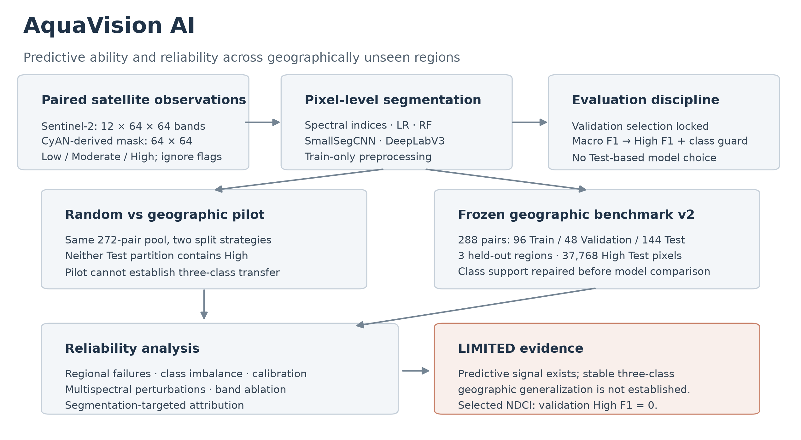
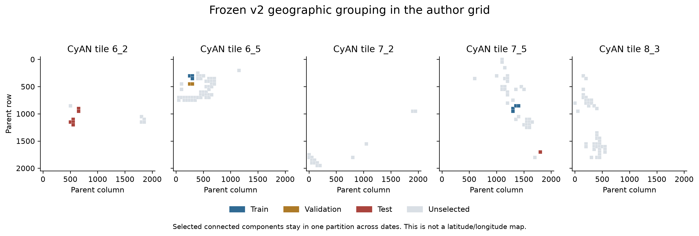
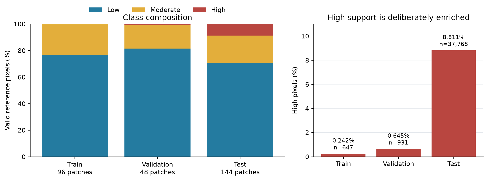
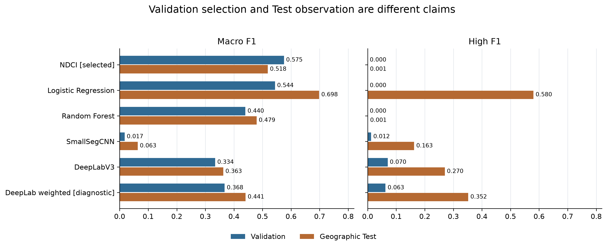
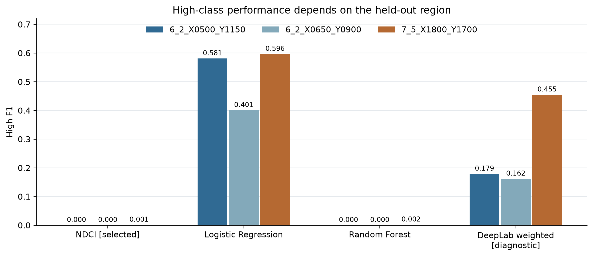
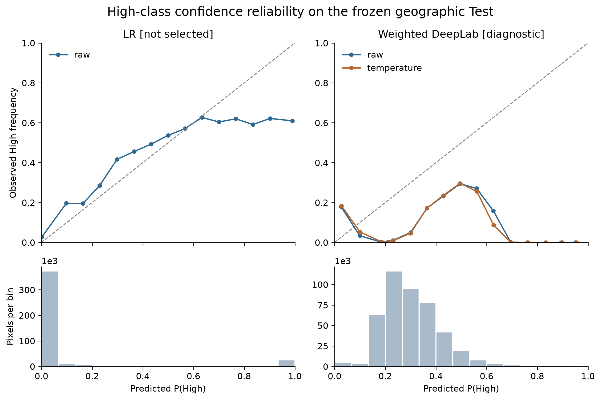
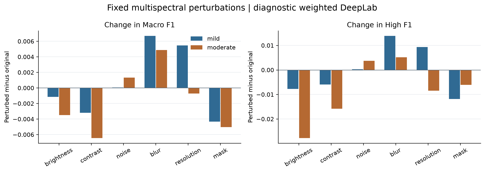
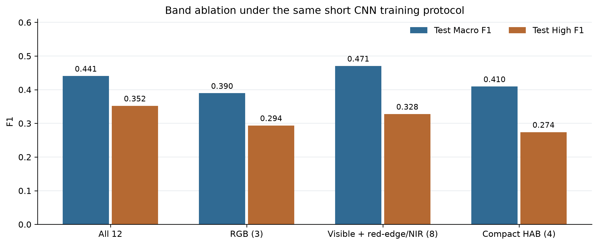
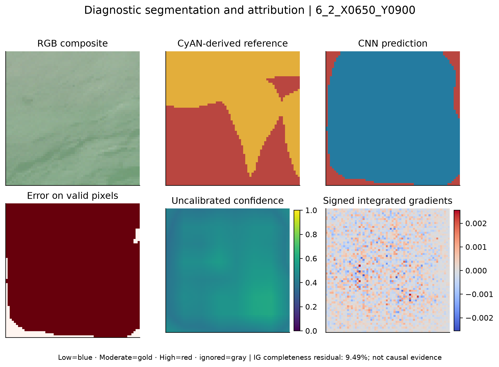
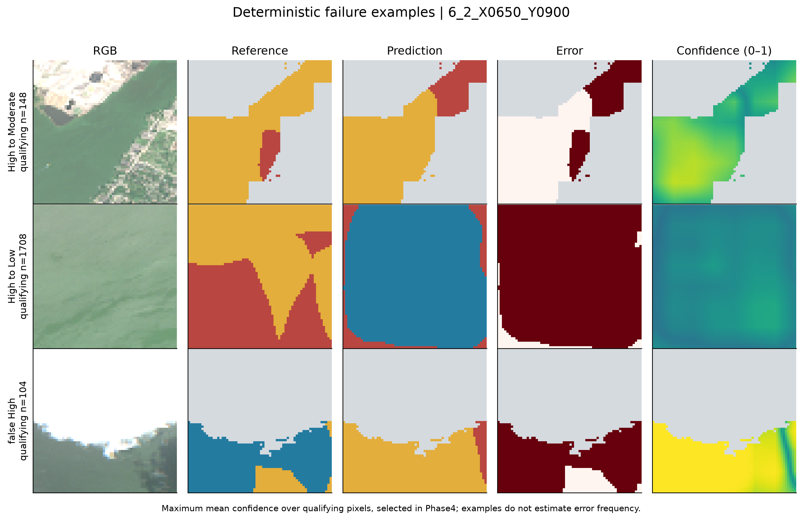

# AquaVision AI

## Abstract

Satellite imagery offers broad coverage for studying cyanobacterial blooms, but predictive scores alone do not establish reliability at new locations. AquaVision investigates this distinction using twelve-band Sentinel-2 patches and spatial reference masks derived from the satellite-based Cyanobacteria Assessment Network (CyAN). Primary-source verification changed the task from proposed image-level classification and cell-concentration conversion to three-class pixel-level semantic segmentation. After an initial pilot lacked High-class test support, a reference audit informed a frozen, deliberately enriched benchmark of 288 paired patches. Its geographic test partition contains 144 patches, three connected geographic components, and 37,768 High-class pixels. Experiments compare five spectral-index baselines, logistic regression, random forest, SmallSegCNN, DeepLabV3/ResNet18, and controlled imbalance and band variants. The registered validation rule selected NDCI, despite validation High F1 of zero, and no CNN met the predefined class-performance guard. Logistic regression achieved geographic-test High F1 of 0.5803, but this observation cannot justify a retrospective selection change. Regional failures, unreliable High-confidence predictions, mixed calibration effects, and short-budget ablations further limit interpretation. The conclusion is **LIMITED**: multispectral observations contain predictive signal for the released CyAN-derived classes, but these experiments do not establish reliable three-class generalization across unseen geographic regions.

## 1. Research Question

**Can Sentinel-2 multispectral imagery identify cyanobacterial bloom risk, and how reliably do these predictions generalize to geographically unseen regions?**

The project evaluates both predictive ability and reliability under geographic distribution shift. Here, “risk” names the source dataset's Low, Moderate, and High reference classes. It does not mean directly measured toxin concentration or a validated public-health decision.

## 2. Motivation

Nearby satellite patches can share water conditions, atmospheric effects, acquisition dates, and spatial texture. A random patch split may therefore place related observations in both training and testing, producing an optimistic estimate of performance at genuinely new locations. Evaluation should respect the dependence structure relevant to the intended use. This motivation is consistent with [Roberts et al., *Ecography* (2017)](https://doi.org/10.1111/ecog.02881).

AquaVision compares a matched random/geographic pilot and then evaluates a separate geographic benchmark with adequate High-class support. It does not treat the pilot-to-expanded change as an isolated split effect, because the data pools and class compositions differ.

*Figure 1. Paired satellite inputs and references, evaluation stages, and the final reliability conclusion. Sentinel-2 does not generate the CyAN label; the reference is a separate satellite-derived observation processed by the dataset authors.*

## 3. Data

The source is [Zenodo dataset version 14230064](https://doi.org/10.5281/zenodo.14230064), associated with [Schloer and Hänsch's cyanobacterial-bloom segmentation study](https://doi.org/10.1109/JSTARS.2025.3629586). The verified author implementation is pinned to [commit e24e311](https://github.com/cschloer/hab_detection_s2/tree/e24e311bdbcdb06c07e7bbe6e21433e69ff7cd37).

Each input is a `12 × 64 × 64` Sentinel-2 array. Band order is `B01, B02, B03, B04, B05, B06, B07, B08, B8A, B09, B11, B12`; B10 is absent. Each paired CyAN reference is a `64 × 64` processed digital-number mask. Training targets are integer spatial maps:

| Stored reference DN | Training class | Meaning in this project |
| --- | --- | --- |
| 0–99 | Low, 0 | Source-defined lower reference category |
| 100–199 | Moderate, 1 | Source-defined middle reference category |
| 200–253 | High, 2 | Source-defined upper reference category |
| 254, 255, or invalid value | Ignore, −100 | Excluded from loss and metrics |

Zero is retained in Low according to the source bins, without asserting zero cyanobacteria. Mask flags can combine land/cloud/no-data causes. The arrays are **satellite-derived references, not direct laboratory ground truth**. The source pipeline resamples nominally coarse, approximately 300 m CyAN data; interpolation does not create independent biological observations at the finer Sentinel grid. Bare arrays do not establish exact footprints or waterbody identities.

Six archive inventories contain 404,450 unique paired records. Phase 3.5 decoded 38,002 real reference masks, including complete coverage of the original 24,518-pair index. These counts describe indexing and screening, not model-training volume or a census of the whole source corpus. The final frozen v2 experiment uses **288 pairs**, acquired in 2019–2020:

| Partition | Patches | Geographic components | Valid pixels | Low | Moderate | High |
| --- | ---: | ---: | ---: | ---: | ---: | ---: |
| Train | 96 | 2 | 267,862 | 205,627 | 61,588 | 647 |
| Validation | 48 | 1 | 144,289 | 117,518 | 25,840 | 931 |
| Geographic Test | 144 | 3 | 428,659 | 302,384 | 88,507 | 37,768 |

Sources: [support table](../phase3_5/split_support.csv), [reference audit](../phase3_5/high_support_summary.json), and [frozen membership](../../data/metadata/phase3_5/geographic_split_v2.json). The test subset is deliberately High-enriched; it is not a prevalence-representative sample of natural waters.

## 4. Scientific Reframing

The initial design considered image-level classification and physical cells/mL thresholds. Inspection of the paper, author code, reference encoding, and resampling chain did not justify that target construction. The published task instead supports discrete pixel-level segmentation using the processed DN intervals above.

The project consequently retained the spatial reference maps, disabled unsupported physical conversion, and implemented explicit ignored-pixel semantics. Earlier aggregation and conversion investigations remain archived, rather than being rewritten as though the segmentation framing had been known initially. The methodological correction is documented in [Original Pipeline Reconstruction](ORIGINAL_PIPELINE_RECONSTRUCTION.md). Dataset interpretation changed the experiment before its conclusions were drawn.

## 5. Experimental Design

The initial pilot selected 272 pairs without using their labels and compared random and geographic partitions of that same pool. Neither test partition contained High reference pixels, making High recall and F1 undefined there. Good-looking pooled metrics could not answer the three-class question.

Phase 3.5 corrected support through a documented reference audit, fixed eligibility criteria, and a new versioned geographic subset. Geographic components group touching or diagonally adjacent author-selected parent windows within the same CyAN tile, including their transitive connections. All dates for a component stay in one partition. Three held-out components are represented, but separate components are not proven separate lakes or independent bloom episodes.

*Figure 2. Partition membership in the source author grid. These coordinates are not latitude/longitude; gray parents were not included in v2.*

Split membership, data hashes, preprocessing, and original model configurations were frozen. Normalization uses training inputs only. Classical feature scaling and threshold fitting use training pixels only. Phase 4 registered its candidate comparison and selection rule before evaluating new variants on Test. Earlier Phase 3.5 baseline test results were already known, so the overall study must not be described as wholly blind.

The primary selection measure is validation Macro F1, followed by validation High F1. Eligibility requires Low F1 ≥ 0.50 and Moderate F1 ≥ 0.25. Within each neural run, the original minimum unweighted validation cross-entropy checkpoint rule remains unchanged to isolate the loss intervention. Full rules and timestamps appear in [Model Selection Protocol](MODEL_SELECTION_PROTOCOL.md) and [registration metadata](../../data/metadata/phase4/preregistration.json).

## 6. Models

| Family | Evaluated configuration or role |
| --- | --- |
| Spectral indices | NDCI, NDVI, FAI, B8AB4, B3B2, with thresholds fitted on training pixels |
| Logistic Regression | Standardized 22-feature pixel representation: twelve bands, five indices, five missing-index indicators |
| Random Forest | Same sampled training pixels/features; 64 trees, depth cap 12, minimum leaf size 2 |
| SmallSegCNN | Small encoder/decoder predicting three spatial classes; random initialization |
| DeepLabV3 / ResNet18 | Twelve input channels, three outputs; random initialization |
| Controlled variants | Separate classical weighting/sampling; CNN weighted CE or focal loss; three registered band ablations |

Simple methods establish whether complex spatial models add useful evidence in this data regime. Phase 4 adds eight imbalance variants and three band ablations to nine frozen baselines. No architecture search was performed. Neural runs retain the bounded three-epoch SmallSegCNN and two-epoch DeepLab protocol. These are controlled short-budget comparisons, not claims about fully converged architectures.

## 7. Metrics

Accuracy can remain high when a rare, important class is missed. Macro F1 gives equal weight to each of the three class F1 scores. High precision measures false-High burden; High recall measures missed High references; High F1 balances the two. Per-region scores expose heterogeneity that pooled metrics can conceal.

All scores exclude ignore pixels. Unsupported-class F1 is reported as unavailable; the historical pilot's fixed-three-slot Macro F1 uses zero contribution for absent classes, which limits comparison with v2. Calibration uses 15-bin top-label ECE, one-v-rest High ECE, negative log likelihood, and multiclass Brier score. ECE is not a substitute for class discrimination.

*Figure 3. High prevalence is approximately 0.242% in Train, 0.645% in Validation, and 8.811% in Test. Pixel counts do not measure independent sample size.*

## 8. Main Results

The central table is generated from frozen machine-readable outputs. ECE is uncalibrated top-label ECE. Robustness is the worst change in Macro F1 over twelve fixed perturbations and was measured only for the diagnostic CNN. N/A means unmeasured or unavailable, not zero.

| Model | Validation Macro F1 | Validation High F1 | Geographic Macro F1 | Geographic High F1 | ECE | Robustness delta Macro F1 | Selection Status |
| --- | --- | --- | --- | --- | --- | --- | --- |
| NDCI | 0.5751 | 0.0000 | 0.5185 | 0.0006 | N/A | N/A | Validation-selected; High failure |
| Logistic Regression | 0.5437 | 0.0000 | 0.6983 | 0.5803 | 0.0787 | N/A | Comparator; not selected |
| Random Forest | 0.4400 | 0.0000 | 0.4794 | 0.0012 | 0.0442 | N/A | Comparator; not selected |
| SmallSegCNN | 0.0175 | 0.0123 | 0.0632 | 0.1627 | 0.2690 | N/A | Comparator; not selected |
| DeepLabV3 / ResNet18 | 0.3343 | 0.0701 | 0.3627 | 0.2700 | 0.1579 | N/A | Comparator; not selected |
| DeepLab + weighted CE | 0.3676 | 0.0625 | 0.4407 | 0.3522 | 0.1131 | -0.0064 | Diagnostic CNN; failed guard |

[Exact CSV](../tables/final_results.csv) · [Table definitions and sources](../tables/final_results.md) · [All experiments](CLASS_IMBALANCE_EXPERIMENTS.md) · [Full reliability matrix](MODEL_RELIABILITY_MATRIX.md).

*Figure 4. The displayed order is fixed, not sorted by Test performance. Validation selection and Test observations serve different purposes.*

## 9. Model Selection Result

The registered Phase 4 validation rule selected **NDCI**, with validation Macro F1 **0.5751** and validation High F1 **0**. There are 931 validation High pixels, so this zero is a measured failure, not an absent-class artifact. No CNN met both predefined class-performance floors.

Weighted DeepLab is the prespecified diagnostic fallback among CNNs. Its validation Low/Moderate/High F1 values are 0.8507/0.1895/0.0625; Moderate falls below the 0.25 guard. It is used for analysis, not certified as an eligible final predictor.

Logistic Regression achieved geographic-test High F1 **0.5803** and Macro F1 **0.6983**. Selecting it because those test scores look better would use Test to choose the hypothesis being evaluated. The reported score would then reflect selection among observed outcomes, introducing selection bias. The validation result must stand, and the LR result remains a descriptive test observation. Any changed decision procedure would require a genuinely new external evaluation, not a rewritten claim about this benchmark.

## 10. Geographic Generalization

**The experiments provide evidence of predictive signal, but performance was not sufficiently stable across unseen regions to support a claim of reliable three-class geographic generalization.**

LR's regional High F1 ranges from **0.4006 to 0.5964**. The diagnostic weighted CNN ranges from **0.1616 to 0.4546**. Selected NDCI has zero High F1 in both held-out 6_2 components and approximately 0.0008 in the 7_5 component. One region contributes 27,850 of 37,768 High test pixels, or 73.74%, so pooled scores depend strongly on its composition.

*Figure 5. Three observed regional scores, without a population confidence interval. See [leave-one-region-out sensitivity](../phase4/leave_one_region_out.csv); individual pixels were not bootstrapped as independent observations.*

## 11. Class Imbalance

The original classical training sample has 24,540 pixels, including only 56 High pixels. LR and RF weighting variants use exactly that same sample. Balanced sampling draws equal class counts from the same pool, so its 8,180 High draws repeat only those 56 unique pixels. CNN weighting uses all valid training-mask pixels, including 647 High pixels.

Weighted and balanced RF each predict one false High pixel and detect no true High pixels. LR rebalancing trades off precision, recall, and other-class performance and does not exceed the original LR's test High F1. Weighted DeepLab improves test Macro F1 from 0.3627 to 0.4407 and High F1 from 0.2700 to 0.3522, but still fails the validation guard. Focal loss does not establish a useful improvement in the fixed budget. SmallSegCNN's near-universal High predictions illustrate why recall alone is inadequate.

RF contains minority examples in its trees; its failure is not explained by a silently omitted class. LR, conversely, recalls none of the 56 sampled training High pixels and none of validation High, despite its stronger Test score. Differences in feature distributions and decision geometry are plausible contributors, but the analysis does not establish one causal mechanism. Details: [LR versus RF](LR_VS_RF_ANALYSIS.md) and [controlled imbalance experiments](CLASS_IMBALANCE_EXPERIMENTS.md).

## 12. Calibration

For LR predictions labeled High with confidence at least 0.8, only **60.96%** are correct overall and **46.55%** in its worst High-F1 region. The diagnostic CNN makes **510** such predictions with **zero** true positives. These are correlated pixel counts, not 510 independent events.

Positive scalar temperature scaling was fitted on Validation only for neural checkpoints. Every classification argmax remains unchanged. For weighted DeepLab, test NLL improves from 1.1237 to 1.1124, while ECE worsens from 0.1131 to 0.1231 and Brier worsens from 0.5536 to 0.5572. Calibration transfer is therefore mixed, and calibration does not repair classification failure.

*Figure 6. High one-v-rest reliability curves and bin support. Sparse bins and enrichment limit interpretation. Only the original matched pilot supports a random-versus-geographic calibration comparison; v2 is a different pool. [Full calibration analysis](CALIBRATION_ANALYSIS.md).* 

## 13. Robustness

The diagnostic CNN was evaluated under registered mild and moderate brightness, contrast, shared spectral noise, blur, resolution degradation, and partial masking. Common spectral parameters preserve inter-band relationships where feasible. The transformations are bounded synthetic probes, not validated simulations of real atmospheric conditions.

The largest pooled Macro F1 decrease is **0.0064**, under moderate contrast; the largest High F1 decrease is **0.0278**, under moderate brightness. Some blur settings improve the score. This does not prove robust operation when the starting classifier is weak. Contrast and noise also trigger nonnegativity clipping; reported effects combine the nominal transformation and clipping. Partial masks use training-mean replacement and are explicitly obstruction artifact stress.

*Figure 7. Perturbed minus original F1. Original Macro/High F1 are 0.4407/0.3522. [Per-region results and severity definitions](ROBUSTNESS_ANALYSIS.md).* 

## 14. Multispectral Band Ablation

Four input-information settings were compared under the same weighted DeepLab architecture and training protocol: all twelve bands; RGB; eight visible/red-edge/NIR bands; and a compact B04/B05/B8A/B11 set informed by the verified NDCI/FAI ingredients. Inactive channels are zero after training-only normalization, meaning training-mean imputation, not zero reflectance.

All twelve bands exceed RGB by **0.0512 Macro F1** and **0.0584 High F1** on Test in this run. However, the eight-band variant has higher Macro F1 and lower High F1 than all twelve. Single-seed, two-epoch results suggest useful extra spectral information but do not demonstrate a reliable general advantage or an optimal subset. Ablations do not change the locked winner.

*Figure 8. Registered subsets, with no exhaustive search. [Band mapping and limitations](BAND_ABLATION.md).* 

## 15. Explainability

Integrated gradients attributes the mean High logit over a fixed true-High pixel region, which is a scalar target derived directly from segmentation outputs. The baseline is the training mean spectrum, and the target mask stays fixed during integration. This avoids treating a segmentation model as an image classifier without adapting its target.

*Figure 9. The pre-existing maximum-High-support attribution example in region 6_2_X0650_Y0900. The figure includes its errors rather than selecting a visually successful patch. The 64-step relative completeness residual is 9.49%, so band-level interpretation is approximate.*

Visible/red-edge inputs contribute to these examples, but correlated channels, context, baseline choice, and integration error affect the maps. **Attribution does not establish causal reasoning.** It does not demonstrate cyanobacteria-specific biological reasoning or explain regional failure causally. [Method, exact sample IDs, and numerical checks](EXPLAINABILITY_ANALYSIS.md).

## 16. Failure Analysis

LR misclassifies 15,114 High pixels as Moderate and 1,667 as Low. RF makes 34,649 High→Moderate and 3,096 High→Low errors. Weighted DeepLab also overpredicts High overall while missing many true High pixels, so a single “underprediction” explanation is insufficient.

*Figure 10. Existing deterministic Phase 4 High→Moderate, High→Low, and false-High cases in the worst High-F1 region. Each patch maximizes mean confidence over qualifying pixels for its category, with sample-ID tie breaking. These extreme diagnostic examples are not prevalence estimates.*

The largest aggregate spectral shift occurs in 7_5_X1800_Y1700, which has the strongest regional High F1 for LR and weighted DeepLab. Their worst High region has the smallest aggregate band-mean shift and the largest monthly composition difference. These patterns do not isolate a cause: geography, season, class prevalence, and reference uncertainty are confounded. Reference processing and possible acquisition-time differences are plausible contributors, not verified explanations for individual errors. [Regional failures](REGIONAL_FAILURE_ANALYSIS.md), [spectral shift](REGIONAL_DISTRIBUTION_SHIFT.md), [temporal composition](TEMPORAL_SHIFT_ANALYSIS.md).

## 17. Limitations

- **Reference meaning and resolution.** CyAN labels are satellite-derived, processed references, not direct laboratory measurements. Bilinear resampling and integer storage can affect boundaries and class transitions. Finer grids do not imply equally fine biological information. No exact cells/mL or toxin target is established.
- **Coverage and imbalance.** The model benchmark contains 288 pairs, not the full indexed corpus. Only two training components and one validation component support fitting and selection. High examples are scarce, while Test is deliberately enriched. Precision and calibration do not directly transfer to natural prevalence.
- **Geographic independence.** Components prevent leakage through known within-tile parent adjacency across dates. Exact footprints, source scene identifiers, lakes, and cross-tile overlap remain incompletely verified. Three test components cannot establish a dependable population uncertainty interval. Spatially correlated pixels exaggerate apparent sample size if counted as independent trials.
- **Spectral and atmospheric variation.** Region-specific spectral distributions differ. Residual cloud, land, atmospheric correction, or other context may matter, but their separate effects are not identified. Synthetic perturbations approximate selected changes and can alter ignored context; they do not reproduce real atmospheric physics.
- **Temporal correspondence.** Filename/code evidence supports same-calendar-day pairing, not simultaneous sensor acquisition. Within-day mismatch remains possible, and coverage is restricted to 2019–2020. Dates, geography, and enrichment are confounded; unique dates are not verified independent bloom episodes.
- **Compute and optimization.** Random initialization, one seed, and short fixed epoch budgets constrain what can be inferred about CNN capability. No inference is made that a model family is intrinsically inferior after full convergence. Full upstream training reproduction is not claimed.
- **Selection uncertainty and prior knowledge.** The validation component may be unrepresentative. The selected model has zero validation High F1, exposing a limitation of the registered criterion for the three-class objective. Earlier baseline Test results were already visible before Phase 4; new-variant evaluation was prospectively controlled, but the whole study was not blind.
- **Reliability.** High performance remains unstable; confidence can be wrong, and temperature scaling does not consistently improve all metrics. The experiment supports no operational guarantee or health-risk threshold.

## 18. Conclusion

AquaVision provides evidence that Sentinel-2 multispectral data contain useful signal for predicting the released CyAN-derived bloom-risk classes. The experiments do not establish reliable three-class generalization across unseen geographic regions. High performance varied by location, the validation-selected NDCI failed High detection, and no deep model satisfied the predefined validation criterion. LR's geographic-test High F1 of 0.5803 remains a descriptive observation rather than a reason to revise selection after seeing Test. The final scientific conclusion is **LIMITED**.

The modeling phase is complete. The project is useful as a reproducible research case about dataset interpretation, spatial evaluation, and the distinction between predictive performance and trustworthy behavior under distribution shift.

## 19. What I Learned

The most consequential decision was to verify what the dataset actually represented before defining the target. That changed the task, preserved spatial information, and prevented an unsupported physical interpretation. Geographic grouping and explicit class-support checks mattered as much as model implementation. A selection rule must be fixed before the test outcomes it governs, including when following it produces an unsatisfying winner. Simple models can outperform short-budget neural runs, but a favorable score alone does not reveal why. Negative results and uncertainty are useful research outcomes when they identify which claims the evidence can and cannot support. Reliability requires attention to geography, minority classes, confidence, and reference quality alongside accuracy.

---

The [final release audit](FINAL_RELEASE_AUDIT.md) records tests, immutable-artifact checks, exact metric reloads, claim provenance, and packaging limitations. The [archive index](ARCHIVE_INDEX.md) explains which historical documents describe superseded stages. A [600–900-word project summary](PORTFOLIO_SUMMARY.md) provides the admissions-oriented entry point.
